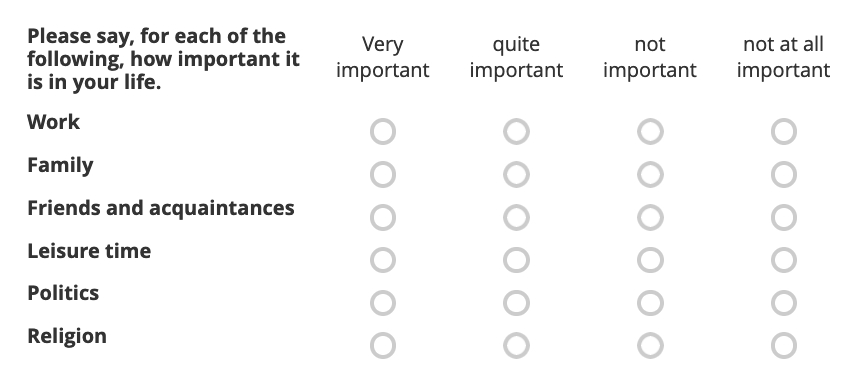

```{r, include = FALSE}
knitr::opts_chunk$set(
  collapse = TRUE,
  comment = "#>",
  message = FALSE
)
```

## Introduction

This article demonstrates some techniques for cleaning and wrangling data returned by the `get_submissions` method of the `Kobo` and `Asset` classes. The vignette is broken down by the different question types. In general, users should make heavy use of the question options to give [custom column names](https://support.kobotoolbox.org/question_options.html#data-column-name) and labels for answer options. This will result in better behaving column names and make data cleaning easier.

```{r setup}
devtools::load_all()
library(kbtbr)
library(tidyr)
library(stringr)
library(dplyr)
BASE_URL <- "https://kobo.correlaid.org"
```

```{r include=FALSE}
kobo <-
  Kobo$new(base_url_v2 = BASE_URL,
           kobo_token = Sys.getenv("KBTBR_TOKEN"))
vcr::use_cassette("kobo-asset-submissions-data", {
  submissions_df <- kobo$get_submissions("aRo4wg5utWT7dwdnQQEAE7")
})
```


```{r eval=FALSE}
kobo <-
  Kobo$new(base_url_v2 = BASE_URL,
           kobo_token = Sys.getenv("KBTBR_TOKEN"))
asset_id <- "aRo4wg5utWT7dwdnQQEAE7"
submissions_df <- kobo$get_submissions(asset_id)
```

Let's look at the column names:
```{r}
colnames(submissions_df)
```

The form contains questions of several of the available types in KoboToolbox. The whole list of available types can be found [here](https://support.kobotoolbox.org/question_types.html). More information also on the [xlsform](https://xlsform.org/en/) page. 

Our test form includes:

- select one: `Taking_all_things_to_ould_you_say_you_are` (an example for a bad question label!), `health_self_assessment`, `voluntary_activity`, `trust_in_others`
- [rating](https://support.kobotoolbox.org/rating_ranking.html#how-to-add-a-rating-question): `trust_in_groups/{category}`, `trust_in_groups/{importance_in_life}`
- range: `control_over_life`
- point (location): `locate_hamburg`
- file upload: `file_upload`

The rest of the columns are metadata automatically added by KoboToolbox. Most of them start with `_`. 


## Column names 
### Sorting 
As could be seen above, the API does not provide a meaningful sorting of the columns.

Some initial reordering to at least put the metadata columns to the front:


```{r}
library(dplyr)
submissions_df <- submissions_df %>%
  select(starts_with("_"), start, end, everything())
colnames(submissions_df)
```

For very large forms, it might be useful to investigate on how to sort the columns alphabetically or by the order they appeard in the form. With the small form here, we can still individually select the columns to put them into a meaningful order:


```{r}
submissions_df <- submissions_df %>%
  select(
    starts_with("_"),
    start,
    end,
    Taking_all_things_to_ould_you_say_you_are,
    starts_with("importance_in_life"),
    trust_in_others,
    starts_with("trust_in_groups"),
    control_over_life,
    voluntary_activity,
    locate_hamburg,
    health_self_assessment,
    file_upload
  )
```

### Cleaning column names
Fortunately, the KoBoToolbox API already has quite sensible column names, with snakecase (i.e. "_" separator) being the default. Column names are determined by the *question name* and thus are configurable via [xlsform](https://xlsform.org/en/#the-survey-worksheet) or the KoboToolbox interface (question settings -> "Data column name").

Typically, it is a good idea to immediately clean column names with a function like `janitor::clean_names`. However, this might be disadvantageous when wrangling rating type questions because question name and category name are conveniently separated by a "/" for those questions.

Hence, we can only clean the meta data column names, removing the "_" at the beginning:
```{r}
library(janitor)
renamed_meta <- submissions_df %>%
  rename_with(make_clean_names, starts_with("_"))
```

Alternatively, we can exclude the rating questions and clean all the other names:

```{r}
library(janitor)
renamed_except_rating <- submissions_df %>%
  rename_with(make_clean_names,-starts_with(c("importance_in_life", "trust_in_groups")))
colnames(renamed_except_rating)
```

For the purposes of the rest of this article, we choose the second version:

```{r}
submissions_df <- renamed_except_rating
```

## Data cleaning

### Type conversion 
In general, the KoBoToolbox API will return all data as character vectors. Hence, conversion is necessary where applicable.

To convert multiple columns at once, you can use [`dplyr::across`](https://dplyr.tidyverse.org/reference/across.html) in combination with the [tidyselect helpers](https://tidyselect.r-lib.org/reference/select_helpers.html):


To check which columns need converting:
```{r}
glimpse(submissions_df)
```

```{r}
submissions_df <- submissions_df %>%
  mutate(across(c(starts_with(
    c("importance_in_life", "trust_in_groups")
  ),
  any_of(
    c(
      "voluntary_activity",
      "control_over_life",
      "health_self_assessment",
      "trust_in_others",
      "Taking_all_things_to_ould_you_say_you_are"
    )
  )), as.integer))
glimpse(submissions_df)
```

### Location/Point type
For the geographic point question type where respondents can pick a location on a map, the response is returned as a character vector which contains the following elements seperated by whitespace:
- latitude
- longitude
- altitude
- accuracy 

```{r}
head(submissions_df$locate_hamburg)
```

To seperate them into their individual components, you can use `tidyr::seperate`:


```{r}
# define the new column names
new_column_names <-
  paste("locate_hamburg", c("lat", "lon", "altitude", "accuracy"), sep = "_")

# use separate to split the column into four columns
submissions_df <- submissions_df %>%
  separate(locate_hamburg, new_column_names, sep = " ") %>%
  mutate(across(starts_with("locate_hamburg"), as.numeric)) # convert to double
# inspect the result
submissions_df %>%
  select(starts_with("locate_hamburg"))
```
### Rating questions

For rating questions - the question type corresponding to Likert scale type question matrices - one column is returned for each "subquestion". For example:



will be returned as six columns starting with the question label for the whole question, in this case `importance_in_life`:

```{r}
submissions_df %>% 
  select(starts_with("importance_in_life"))
```

The overall question label and the label for each "subquestion" are divided by a '/'. This is an important detail for data cleaning because it allows us to use functions like `tidyr::pivot_longer` to bring the data into a long format (e.g. useful for plotting):


```{r}
imp_life_long <- submissions_df %>%
  select(id, starts_with("importance_in_life")) %>%
  pivot_longer(-id, names_to = "category", values_to = "level") %>%
  mutate(category = str_remove(category, "importance_in_life/") %>% str_replace_all("_", " "))
imp_life_long
```


```{r}
library(ggplot2)
imp_life_long %>%
  group_by(category) %>%
  summarize(mean_level = mean(level)) %>%
  ggplot(aes(x = category, y = mean_level)) +
  geom_col() +
  coord_flip() +
  labs(title = "Mean importance in life by category", y = "mean importance", x = "category")
```


You can wrap this approach in a function:
```{r}
pivot_longer_rating <- function(data, question_name) {
  data %>%
    select(id, starts_with(question_name)) %>%
    pivot_longer(-id, names_to = "category", values_to = "level") %>%
    mutate(category = str_remove(category, paste0(question_name, "/")) %>% str_replace_all("_", " "))
}

submissions_df %>%
  pivot_longer_rating("trust_in_groups")
```
